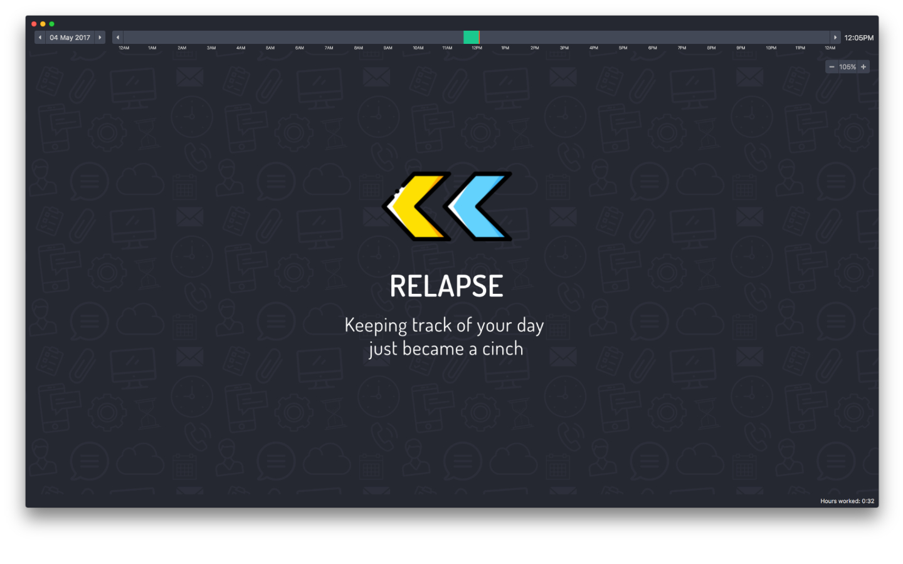
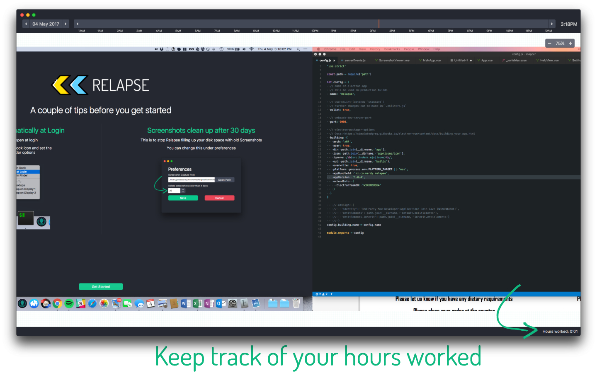
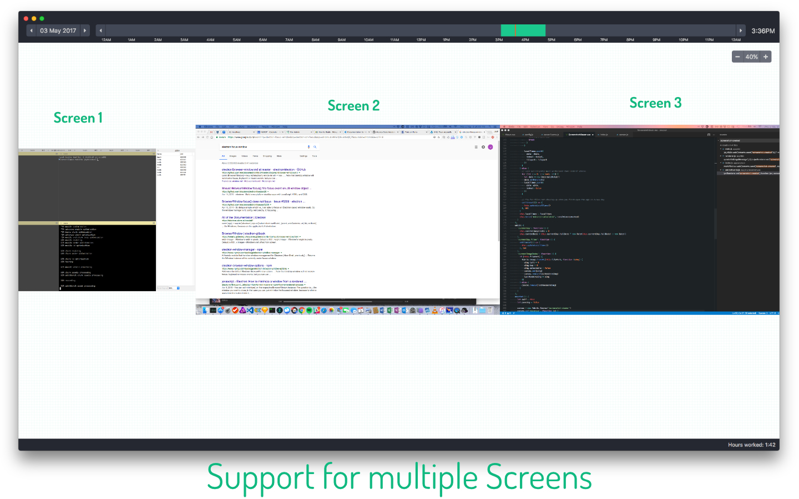

# Relapse

Keeping track of your day just became a cinch

Relapse takes a screen shot of your desktop every minute and allows you to scroll back and forth between your day. 

Works across multiple screens

Mac OSX only

Built using 

 - Vue 3. Wails 3. Go and Twirp.
 - Go
 - [Wails 3](https://github.com/wailsapp/wails)
 - [Twirp](https://github.com/twitchtv/twirp)

> :warning: **NO IMAGES EVER LEAVE YOUR PC**: Your privacy is valuable. Protect it

